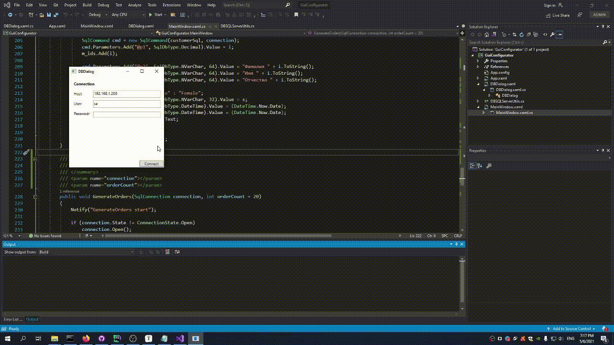
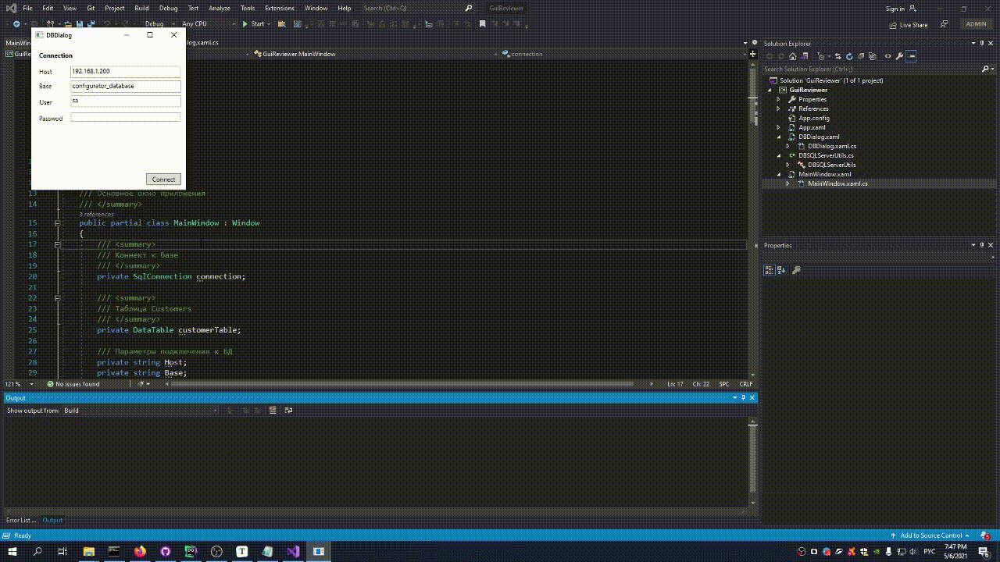

# PointTestTasks

- [CConfigurator ](https://github.com/sergeymsui/PointTestTasks/tree/main/CConfigurator) - конфигуратор БД
- [GuiConfigurator](https://github.com/sergeymsui/PointTestTasks/tree/main/GuiConfigurator) - GUI конфигуратор БД
- [GuiReviewer](https://github.com/sergeymsui/PointTestTasks/tree/main/GuiReviewer) - GUI обозреватель БД

Во всех проектах использовался mssql 2019.

## CConfigurator

Конфигуратор запрашивает параметры подключения к серверу mssql. Подключается к серверу БД. После подключения создает базу заданной структуры. Заполняет ее хардкорными значениями по типу - N, Фамилия N, Имя N, Отчество N, Male/Female, [Текущая дата], [Текущая дата]. Также, заполняет таблицу заказов, выбирая рандомного клиента. Процесс заполнения можно наблюдать через ProgressBar.

Примерный вид работы программы представлен ниже.

## GUIConfigurator

Процесс работы примерно тот же. См. ниже.

## GuiReviewer

Обозреватель БД запрашивает параметры подключения и подключается к БД. В левой области основного окна расположена таблица клиентов, в правой - заказов. При запуске, в диалоговое окно следует ввести адрес сервера mssql (порт стандартный), наименование БД, имя пользователя и пароль. После нажатия на кнопку Connect отобразится основное окно.

Для отображения списка заказов необходимо в левой таблице двойным щелчком мыши выбрать строку клиента.

Примерный вид работы программы представлен ниже.

